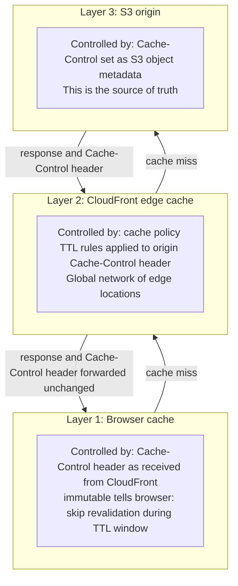
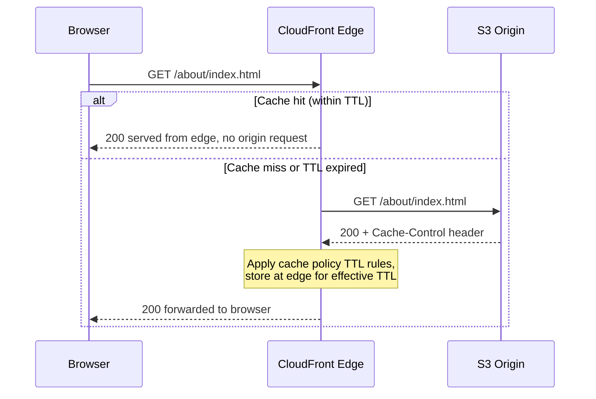
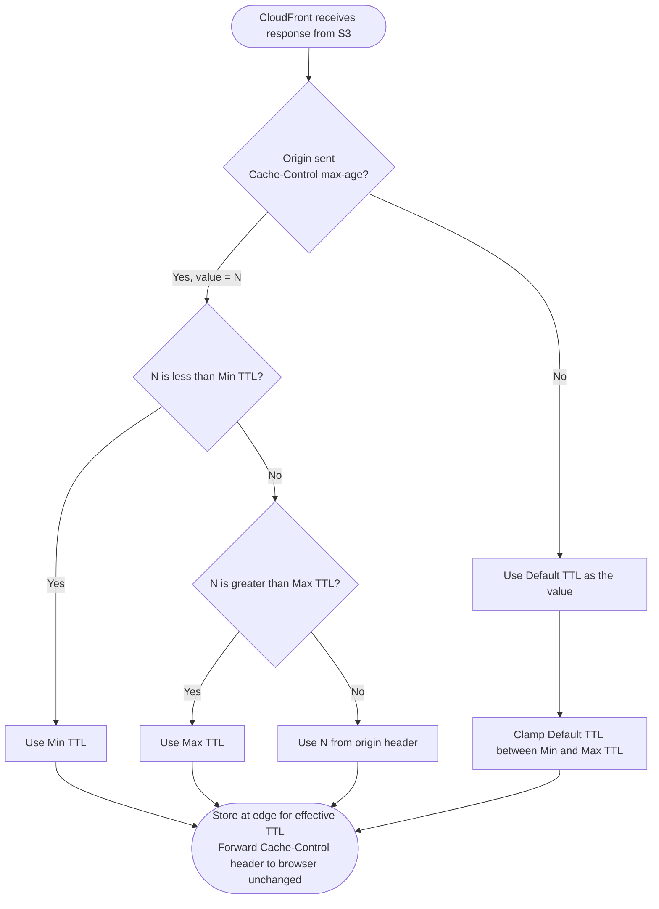

# CloudFront Caching

How CloudFront caching works and how to optimise it for a static Astro site hosted on S3.

---

## How CloudFront caches content

CloudFront has edge locations distributed globally. When it caches a file at an edge location, subsequent requests from nearby visitors are served from that location rather than travelling all the way to S3 in us-east-1. This reduces latency, reduces the number of requests hitting S3 (lowering origin load and egress costs), and improves performance for visitors regardless of where they are in the world.

When a visitor requests a file, CloudFront checks its edge cache. On a cache hit it serves the file immediately. On a cache miss it fetches from S3, stores the response at the edge, then serves it. CloudFront determines whether a cached object is still valid using its TTL (time to live). Once TTL expires, the next request triggers a revalidation with S3.

### Caching layers

There are three independent caches in the request path. Understanding all three matters because misconfiguring any one of them can cause visitors to see stale content or force unnecessary round trips to the origin.



- **Browser cache** avoids any network request entirely. Fastest possible response. Controlled by the `Cache-Control` header the browser received from CloudFront.
- **CloudFront edge cache** avoids a round trip to S3. Serves from the nearest edge location. Controlled by the cache policy TTL rules.
- **S3 origin** is the fallback when neither cache has the object. Slowest. Only hit on cache miss.

### Request flow



---

## TTL and Cache-Control

TTL (time to live) is how long a cached copy is considered valid before it must be checked again. Getting TTL wrong has real consequences: too long and visitors see stale content after a deploy; too short and every request hits the origin, eliminating the performance and cost benefits of caching.

The cache policy defines three TTL settings. Together they clamp the origin's `Cache-Control: max-age` value into an allowed range:

```
effective_ttl = clamp(origin_max_age, min_ttl, max_ttl)
```

| Policy setting | Role | Behaviour |
|---|---|---|
| **Minimum TTL** | Floor | Origin cannot go lower. If origin sends `max-age=10` and Min TTL is 60, CloudFront caches for 60s. If Min TTL > 0 and origin sends `no-cache`, CloudFront still caches for Min TTL. |
| **Maximum TTL** | Ceiling | Origin cannot go higher. If origin sends `max-age=999999` and Max TTL is 86400, CloudFront caches for 86400s. |
| **Default TTL** | Fallback | Used only when origin sends no `Cache-Control` header at all. Has no effect when origin sends `max-age`. |

Setting Min TTL to `0` lets CloudFront honour origin headers exactly, including `no-cache` and `no-store`. This is the right choice for HTML files where you want per-object control from S3 metadata.

### TTL precedence



The browser always receives the origin's `Cache-Control` header unchanged. CloudFront's TTL policy only controls how long CloudFront itself caches the object. Browser TTL and edge TTL are independent.

The `immutable` directive in `Cache-Control: max-age=31536000, immutable` is a browser-only instruction. It tells the browser not to revalidate during the TTL window even on manual refresh. Without `immutable`, some browsers send a conditional request (`If-None-Match`) mid-TTL just to check, even though the file cannot have changed. CloudFront itself ignores `immutable` but does respect `max-age`.

---

## Managed cache policies

AWS provides built-in policies to avoid writing common configurations from scratch. Reference by ID in Terraform or the CLI.

| Policy name | ID | Use case |
|---|---|---|
| `CachingOptimized` | `658327ea-f89d-4fab-a63d-7e88639e58f6` | Hashed static assets (`/_astro/*`, `/fonts/*`) |
| `CachingDisabled` | `4135ea2d-6df8-44a3-9df3-4b5a84be39ad` | API endpoints, dynamic content. TTL set to 0. |

### CachingOptimized

A cache policy defines two things: what goes in the cache key, and what TTL values to apply.

**Cache key** — `CachingOptimized` includes only:

- The URL path
- The `Accept-Encoding` header (normalised)

Everything else (query strings, cookies, other headers) is excluded. This maximises cache hits: two requests for the same path are always treated as the same object, so CloudFront never makes unnecessary origin requests for content it already has.

The `Accept-Encoding` header is included because CloudFront stores separate cached copies per compression format. A modern browser sends `Accept-Encoding: br, gzip` and receives a Brotli-compressed file. An older browser sends `Accept-Encoding: gzip` and receives a gzip-compressed file. Without this in the cache key, CloudFront would serve the same cached copy to all browsers, potentially sending a Brotli file to a browser that cannot decompress it. "Normalised" means CloudFront reduces the header to its canonical form before keying, so `br, gzip, deflate` and `gzip, br` map to the same cache entry rather than creating redundant copies.

**TTL values:**

| Setting | Value |
|---|---|
| Min TTL | 1s |
| Default TTL | 86,400s (24h) |
| Max TTL | 31,536,000s (1 year) |

Min TTL is 1, not 0. Even if S3 sends `Cache-Control: no-cache`, CloudFront still caches for 1 second. For hashed assets this is fine. For HTML it is a problem: if a visitor lands mid-deploy and gets a 1-second cached copy of the old HTML, it will reference asset URLs that may no longer exist. Use a custom policy with Min TTL = 0 for HTML so `max-age=0, must-revalidate` is always respected.

**Use `CachingOptimized` for:** hashed static assets only (`/_astro/*`, `/fonts/*`). Never for HTML or any file with a stable URL that changes on deploy.

---

## Per-path cache behaviours

Different files have different freshness requirements. HTML must always be current so visitors see the latest deploy. Hashed assets can be cached forever because their URLs change with every content change. Using one cache policy for everything means either assets are re-fetched too often (wasting bandwidth and increasing latency) or HTML goes stale (visitors see outdated content).

Per-path cache behaviours solve this by applying different policies to different URL patterns. CloudFront matches incoming request paths in order of specificity. A distribution supports up to 75 behaviours plus one default.

Recommended setup for an Astro static site:

| Path pattern | Cache policy | Cache-Control on S3 object |
|---|---|---|
| `/_astro/*` | `CachingOptimized` or custom long-TTL | `public, max-age=31536000, immutable` |
| `/fonts/*` | `CachingOptimized` or custom long-TTL | `public, max-age=31536000, immutable` |
| `*` (default) | Custom with Minimum TTL 0 | `public, max-age=0, must-revalidate` |

Astro hashes filenames for all files under `/_astro/` at build time (e.g. `Button.abc123de.css`). On each deploy, HTML files are served fresh (no cache). Those HTML files reference the new hashed asset URLs. The browser has never seen those URLs, so it fetches and caches them. Old cached assets are never requested again because nothing points to them. Long-TTL caching is safe because cache busting happens at the HTML layer, not the asset layer.

Files in `public/` (favicon, robots.txt, fonts) are copied to the root with no hash. If their content changes between deploys, browsers holding a cached copy will not know. Either accept that they can go stale, or version them manually.

---

## Setting Cache-Control headers on S3 objects

CloudFront cache behaviours control the **edge TTL** (how long CloudFront holds the object). The `Cache-Control` header on the S3 object controls the **browser TTL** (how long the visitor's browser holds it). Both must be set correctly. The S3 sync handles the browser side.

S3 does not set `Cache-Control` by default, so without explicit headers every object gets no browser caching at all, forcing a network request on every page load even for unchanged assets.

Two passes are required because different file types need different headers:

```bash
# Pass 1: hashed assets — cache forever in browser
aws s3 sync dist/ s3://$BUCKET \
  --exclude "*" \
  --include "_astro/*" \
  --cache-control "public,max-age=31536000,immutable" \
  --metadata-directive REPLACE

# Pass 2: HTML and everything else — never cache in browser
aws s3 sync dist/ s3://$BUCKET \
  --exclude "_astro/*" \
  --cache-control "public,max-age=0,must-revalidate" \
  --metadata-directive REPLACE \
  --delete
```

**Why two passes:** each pass sets a different `Cache-Control` header. There is no way to set per-object headers conditionally in a single sync call.

**Why `--delete` only on pass 2:** `--delete` removes S3 objects that no longer exist in `dist/`. Running it on pass 1 would delete old HTML files before pass 2 has uploaded the new ones, causing 404s mid-deploy. Pass 2 runs after all new files are in place, so deletion is safe.

**Why `--metadata-directive REPLACE`:** `aws s3 sync` skips objects whose content has not changed. Without `REPLACE`, the `Cache-Control` header (stored as S3 object metadata) would not be updated on unchanged files. `REPLACE` forces S3 to rewrite the metadata on every sync regardless of whether the file content changed.

---

## Compression

Compression reduces the size of files transferred over the network. Smaller files download faster, which improves page load time for visitors, and reduces CloudFront data transfer costs (charged per GB served).

CloudFront supports both gzip and Brotli compression. Brotli produces smaller files than gzip for text content. CloudFront automatically serves Brotli to clients that send `Accept-Encoding: br` and falls back to gzip for older clients, so enabling it has no compatibility risk.

Enable compression by setting `compress = true` on the CloudFront distribution in Terraform:

```hcl
default_cache_behavior {
  compress = true
  ...
}
```

CloudFront only compresses specific content types (HTML, CSS, JS, JSON, XML, SVG, plain text). Binary formats (images, woff2) are already compressed and are passed through unchanged, so there is no risk of double-compression inflating file sizes.

Compression requires the cache policy to include `Accept-Encoding` in the cache key so CloudFront stores separate compressed copies per encoding. The `CachingOptimized` managed policy includes this by default.

---

## Cache invalidation

Cache invalidation forces CloudFront to remove objects from its edge caches before their TTL expires. Use it when a deploy has gone wrong and you need stale content purged immediately, rather than waiting for TTL to expire naturally.

CloudFront includes a free monthly allowance of invalidation paths. A wildcard path (e.g. `/*`) counts as one path regardless of how many objects it matches. See [AWS CloudFront pricing](https://aws.amazon.com/cloudfront/pricing/) for current figures.

Running `aws cloudfront create-invalidation --paths "/*"` after every deploy costs one path from the free allowance. For a low-frequency deploy pipeline this is well within the free tier.

For HTML files set to `max-age=0, must-revalidate`, both browsers and CloudFront revalidate on every request. Invalidation is unnecessary because the cache never holds a copy long enough to go stale. Reserve invalidation for emergencies, not routine deploys.

---

## Monitoring cache performance

The cache hit rate is the percentage of requests served from the CloudFront edge cache without reaching S3. A low hit rate means more requests are hitting the origin, increasing latency for visitors and increasing S3 request costs. Monitoring it catches misconfigured TTLs or cache keys before they affect users at scale.

Enable additional CloudWatch metrics on the distribution (there is an additional cost per distribution; see [CloudWatch pricing](https://aws.amazon.com/cloudwatch/pricing/)). The key metric is `CacheHitRate` in the `AWS/CloudFront` namespace.

A healthy cache hit rate for a static site is above 85%. A low rate typically indicates:

- HTML files cached with a long TTL and then repeatedly invalidated, creating artificial misses
- Query strings included in the cache key unexpectedly, so `/?foo=1` and `/?foo=2` are treated as different objects
- `Cache-Control: no-store` set on assets that should be cached

Set a CloudWatch alarm on `CacheHitRate` dropping below 80% to catch regressions after config changes.

---

## Sources

- [Manage how long content stays in the cache (expiration)](https://docs.aws.amazon.com/AmazonCloudFront/latest/DeveloperGuide/Expiration.html)
- [Use managed cache policies](https://docs.aws.amazon.com/AmazonCloudFront/latest/DeveloperGuide/using-managed-cache-policies.html)
- [Cache behavior settings](https://docs.aws.amazon.com/AmazonCloudFront/latest/DeveloperGuide/DownloadDistValuesCacheBehavior.html)
- [Increase cache hit ratio](https://docs.aws.amazon.com/AmazonCloudFront/latest/DeveloperGuide/cache-hit-ratio.html)
- [Pay for file invalidation](https://docs.aws.amazon.com/AmazonCloudFront/latest/DeveloperGuide/PayingForInvalidation.html)
- [Amazon CloudFront announces support for Brotli compression](https://aws.amazon.com/about-aws/whats-new/2020/09/cloudfront-brotli-compression/)
- [View CloudFront and edge function metrics](https://docs.aws.amazon.com/AmazonCloudFront/latest/DeveloperGuide/viewing-cloudfront-metrics.html)
- [Using CloudFront managed policies in Terraform](https://craft.mirego.com/2022-08-11-using-cloudfront-s-managed-policies-in-terraform/)
